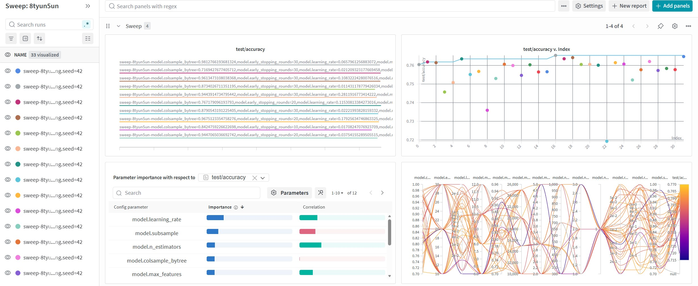
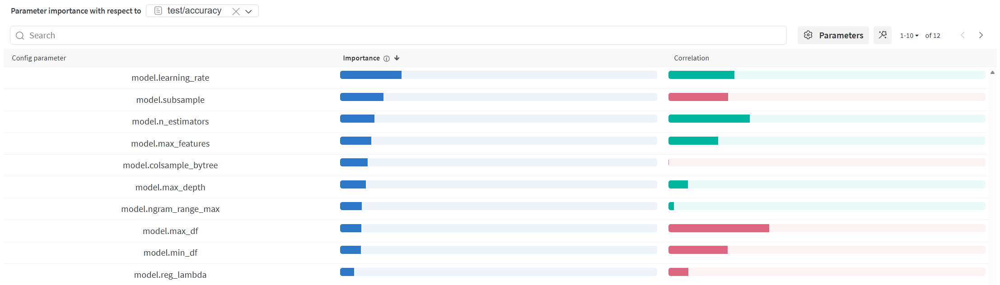
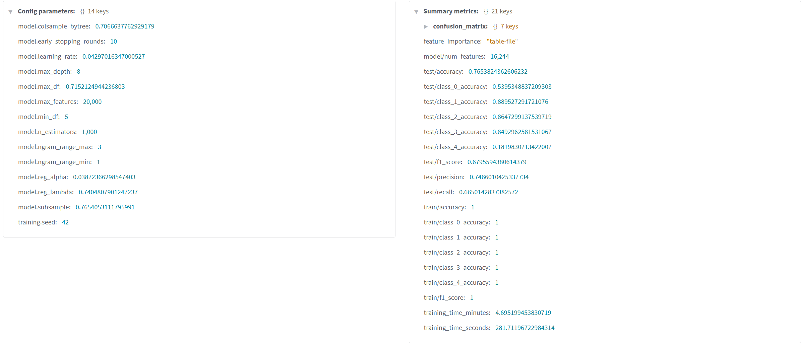
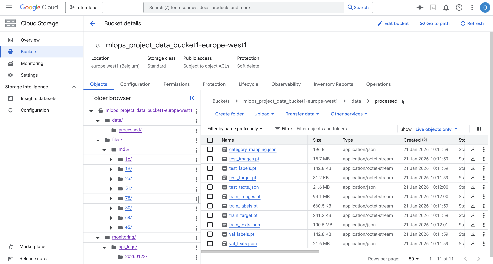
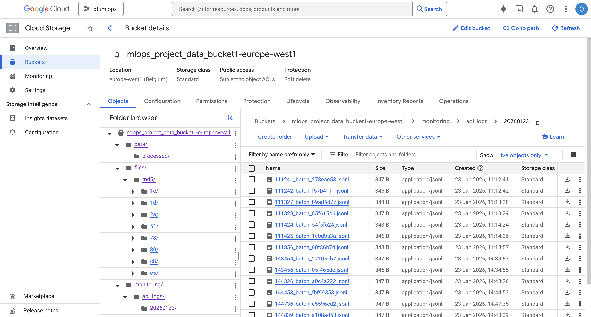
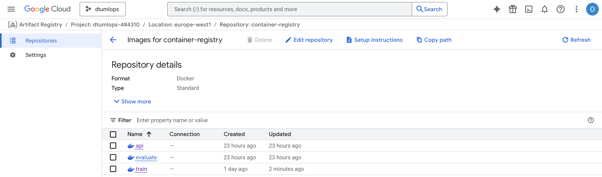
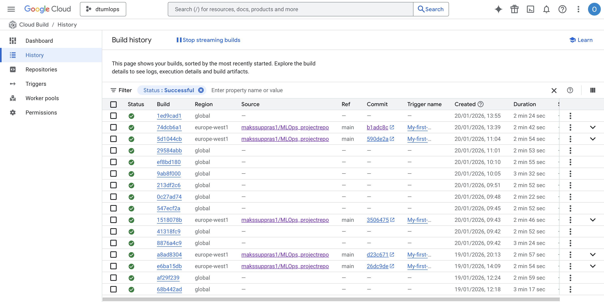

# Exam template for 02476 Machine Learning Operations

This is the report template for the exam. Please only remove the text formatted as with three dashes in front and behind
like:

```--- question 1 fill here ---```

Where you instead should add your answers. Any other changes may have unwanted consequences when your report is
auto-generated at the end of the course. For questions where you are asked to include images, start by adding the image
to the `figures` subfolder (please only use `.png`, `.jpg` or `.jpeg`) and then add the following code in your answer:

``

In addition to this markdown file, we also provide the `report.py` script that provides two utility functions:

Running:

```bash
python report.py html
```

Will generate a `.html` page of your report. After the deadline for answering this template, we will auto-scrape
everything in this `reports` folder and then use this utility to generate a `.html` page that will be your serve
as your final hand-in.

Running

```bash
python report.py check
```

Will check your answers in this template against the constraints listed for each question e.g. is your answer too
short, too long, or have you included an image when asked. For both functions to work you mustn't rename anything.
The script has two dependencies that can be installed with

```bash
pip install typer markdown
```

or

```bash
uv add typer markdown
```

## Overall project checklist

The checklist is *exhaustive* which means that it includes everything that you could do on the project included in the
curriculum in this course. Therefore, we do not expect at all that you have checked all boxes at the end of the project.
The parenthesis at the end indicates what module the bullet point is related to. Please be honest in your answers, we
will check the repositories and the code to verify your answers.

### Week 1

* [x] Create a git repository (M5)
* [x] Make sure that all team members have write access to the GitHub repository (M5)
* [x] Create a dedicated environment for you project to keep track of your packages (M2)
* [x] Create the initial file structure using cookiecutter with an appropriate template (M6)
* [x] Fill out the `data.py` file such that it downloads whatever data you need and preprocesses it (if necessary) (M6)
* [x] Add a model to `model.py` and a training procedure to `train.py` and get that running (M6)
* [x] Remember to either fill out the `requirements.txt`/`requirements_dev.txt` files or keeping your
    `pyproject.toml`/`uv.lock` up-to-date with whatever dependencies that you are using (M2+M6)
* [x] Remember to comply with good coding practices (`pep8`) while doing the project (M7)
* [ ] Do a bit of code typing and remember to document essential parts of your code (M7)
* [x] Setup version control for your data or part of your data (M8)
* [ ] Add command line interfaces and project commands to your code where it makes sense (M9)
* [x] Construct one or multiple docker files for your code (M10)
* [x] Build the docker files locally and make sure they work as intended (M10)
* [x] Write one or multiple configurations files for your experiments (M11)
* [x] Used Hydra to load the configurations and manage your hyperparameters (M11)
* [ ] Use profiling to optimize your code (M12)
* [x] Use logging to log important events in your code (M14)
* [x] Use Weights & Biases to log training progress and other important metrics/artifacts in your code (M14)
* [x] Consider running a hyperparameter optimization sweep (M14)
* [ ] Use PyTorch-lightning (if applicable) to reduce the amount of boilerplate in your code (M15)

### Week 2

* [x] Write unit tests related to the data part of your code (M16)
* [x] Write unit tests related to model construction and or model training (M16)
* [x] Calculate the code coverage (M16)
* [x] Get some continuous integration running on the GitHub repository (M17)
* [x] Add caching and multi-os/python/pytorch testing to your continuous integration (M17)
* [x] Add a linting step to your continuous integration (M17)
* [x] Add pre-commit hooks to your version control setup (M18)
* [x] Add a continues workflow that triggers when data changes (M19)
* [x] Add a continues workflow that triggers when changes to the model registry is made (M19)
* [x] Create a data storage in GCP Bucket for your data and link this with your data version control setup (M21)
* [x] Create a trigger workflow for automatically building your docker images (M21)
* [x] Get your model training in GCP using either the Engine or Vertex AI (M21)
* [x] Create a FastAPI application that can do inference using your model (M22)
* [x] Deploy your model in GCP using either Functions or Run as the backend (M23)
* [x] Write API tests for your application and setup continues integration for these (M24)
* [x] Load test your application (M24)
* [ ] Create a more specialized ML-deployment API using either ONNX or BentoML, or both (M25)
* [ ] Create a frontend for your API (M26)

### Week 3

* [x] Check how robust your model is towards data drifting (M27)
* [x] Setup collection of input-output data from your deployed application (M27)
* [x] Deploy to the cloud a drift detection API (M27)
* [ ] Instrument your API with a couple of system metrics (M28)
* [ ] Setup cloud monitoring of your instrumented application (M28)
* [ ] Create one or more alert systems in GCP to alert you if your app is not behaving correctly (M28)
* [ ] If applicable, optimize the performance of your data loading using distributed data loading (M29)
* [ ] If applicable, optimize the performance of your training pipeline by using distributed training (M30)
* [ ] Play around with quantization, compilation and pruning for you trained models to increase inference speed (M31)

### Extra

* [ ] Write some documentation for your application (M32)
* [ ] Publish the documentation to GitHub Pages (M32)
* [ ] Revisit your initial project description. Did the project turn out as you wanted?
* [ ] Create an architectural diagram over your MLOps pipeline
* [ ] Make sure all group members have an understanding about all parts of the project
* [ ] Uploaded all your code to GitHub

## Group information

### Question 1
> **Enter the group number you signed up on <learn.inside.dtu.dk>**
>
> Answer:

MLOps 130

### Question 2
> **Enter the study number for each member in the group**
>
> Example:
>
> *sXXXXXX, sXXXXXX, sXXXXXX*
>
> Answer:

s204634, s204614, s204598

### Question 3
> **Did you end up using any open-source frameworks/packages not covered in the course during your project? If so**
> **which did you use and how did they help you complete the project?**
>
> Recommended answer length: 0-200 words.
>
> Example:
> *We used the third-party framework ... in our project. We used functionality ... and functionality ... from the*
> *package to do ... and ... in our project*.
>
> Answer:

We used two main approaches for our text classification tasks on scientific papers:

1. **Transformers (Hugging Face)**: We initally used the **DistilBert** model via the Transformers library from Hugging Face as an end-to-end neural text classifier. This library provided pre-trained models and tokenizers, accelerating our NLP pipeline development. However it proved hard to find a sweetspot for training, which resulted in us favoring simpler and older libraries.

2. **TF-IDF + XGBoost**: In addition to deep learning, we implemented a classical pipeline using scikit-learn's **TF-IDF** vectorizer combined with an **XGBoost** classifier. This approach embeds the documents into sparse feature vectors and then uses the gradient boosted tree model for robust classification. Training for this pipeline is handled in our repository via a dedicated script and configuration, allowing us to compare classical and transformer-based methodologies in both local and cloud environments.

Additionally, we incorporated **PyArrow** for efficient data storage and retrieval in Parquet format, enabling faster I/O operations and better compression for our large dataset. **Pillow** was used for image processing tasks, particularly for handling any visual elements or converting image data when needed in our data pipeline.

Both models and training pipelines are available in our codebase, and can be selected via configuration for experimentation or production use.

## Coding environment

> In the following section we are interested in learning more about you local development environment. This includes
> how you managed dependencies, the structure of your code and how you managed code quality.

### Question 4

> **Explain how you managed dependencies in your project? Explain the process a new team member would have to go**
> **through to get an exact copy of your environment.**
>
> Recommended answer length: 100-200 words
>
> Example:
> *We used ... for managing our dependencies. The list of dependencies was auto-generated using ... . To get a*
> *complete copy of our development environment, one would have to run the following commands*
>
> Answer:

We used **UV** for managing our dependencies. Our dependencies are defined in the `pyproject.toml` file for main dependencies and dependency-groups for development dependencies. The exact versions are locked in the `uv.lock` file for reproducible builds. To get a complete copy of our development environment, a new team member would need to:

1) Install UV package manager following the [official guide](https://docs.astral.sh/uv/getting-started/installation/),
2) Clone the repository,
3) Run the following command to create a virtual environment and install all main and development dependencies:
```bash
uv sync --all-groups
```
4) Since we use DVC to track large datasets without bloating the Git history, run the following to pull the data tracked by the project:
```bash
dvc pull
```
5) If additional raw data needs to be fetched, execute the download script:
```bash
sh scripts/download_dataset.sh
```
6) We use `invoke` for project orchestration. To verify ones setup run the following:
```bash
uv run inv --list
```

### Question 5

> **We expect that you initialized your project using the cookiecutter template. Explain the overall structure of your**
> **code. What did you fill out? Did you deviate from the template in some way?**
>
> Recommended answer length: 100-200 words
>
> Example:
> *From the cookiecutter template we have filled out the ... , ... and ... folder. We have removed the ... folder*
> *because we did not use any ... in our project. We have added an ... folder that contains ... for running our*
> *experiments.*
>
> Answer:

Our project utilized the [mlops_template](https://github.com/SkafteNicki/mlops_template), keeping core structures, including the `src/`, `tests/`, and `notebooks/` directories. We filled out `src/data.py` for ArXiv preprocessing and `src/model.py` for our DistilBERT architecture.

However, we modified the projectstructure for production readiness. We replaced the traditional `requirements.txt` with a `pyproject.toml` and `uv.lock` system to leverage the UV package manager. We also removed the standard `docker/` folder in favor of a specialized `dockerfiles/` directory containing multi-stage builds for training, evaluation, and API deployment.

New additions include a `monitoring/` folder for data drift detection, a `scripts/` folder for automation, and a dedicated `app/` directory for our FastAPI implementation. To handle orchestration, we added `tasks.py` file using Invoke, moving away from basic scripts. Finally, we integrated DVC (`.dvc/`) to manage data version control via Google Cloud Storage.

### Question 6

> **Did you implement any rules for code quality and format? What about typing and documentation? Additionally,**
> **explain with your own words why these concepts matters in larger projects.**
>
> Recommended answer length: 100-200 words.
>
> Example:
> *We used ... for linting and ... for formatting. We also used ... for typing and ... for documentation. These*
> *concepts are important in larger projects because ... . For example, typing ...*
>
> Answer:

Throughout this project, we applied concepts to ensure quality through several automated methods. We implemented **Ruff** for linting, alongside **Black** and **isort** for formatting, all standardized to a 120-character line limit. These tools are integrated into our workflow using pre-commit hooks, ensuring that every commit is checked locally before it reaches the repository. Our GitHub Actions pipeline further automates this process, running these checks across different operating systems (*Ubuntu, Windows, macOS*) to ensure cross-platform compatibility.

Using **MkDocs** for the `mkdocstrings` plugin was applied to automatically generate our API documentation directly from our source code.

In the context of a large-scale MLOps project, these concepts are essential for collaborative scalability. Without strict formatting and linting, technical debt accumulates quickly as different contributors introduce varying styles, leading to "noisy" code reviews. Explicit typing and comprehensive documentation serve as a crucial knowledge-transfer mechanism; they transform complex scripts into a readable system. For a student project, this discipline ensures that our architectural decisions remain clear over time, preventing bugs during refactoring and making the onboarding process for new team members much more efficient.

## Version control

> In the following section we are interested in how version control was used in your project during development to
> corporate and increase the quality of your code.

### Question 7

> **How many tests did you implement and what are they testing in your code?**
>
> Recommended answer length: 50-100 words.
>
> Example:
> *In total we have implemented X tests. Primarily we are testing ... and ... as these the most critical parts of our*
> *application but also ... .*
>
> Answer:
I total we have made 17 tests (5 in test_data, 8 in test_model, 4 in test_training) with the focus on testing the code for our data, model and train scripts.

*test_data.py* focuses on the data processing/preprocessing pipeline; Validating that the ArXivDataset classes are initialized correctly, that the expected output files are created, that the train/val/tests split ratios are correct, and checks that the category-to-label mapping are created correctly for classification.

*test_model.py* focuses on model architecture and behavior; Initialization, forward passes, output validation, encoder freezing, parameter counting, and gradient flow.

*test_training.py* focuses on training pipeline and reproducibility; Seed reproducibility, batch collation, and training dynamics.

### Question 8

> **What is the total code coverage (in percentage) of your code? If your code had a code coverage of 100% (or close**
> **to), would you still trust it to be error free? Explain you reasoning.**
>
> Recommended answer length: 100-200 words.
>
> Example:
> *The total code coverage of code is X%, which includes all our source code. We are far from 100% coverage of our **
> *code and even if we were then...*
>
> Answer:

The total code coverage of our code is **48%**, covering 136 out of 285 total statements across our main modules. We are far from 100% coverage, and even if we achieved 100%, we would not trust it to be completely error-free. Code coverage is a quantitative metric showing which lines were executed during testing, but doesn't guarantee test quality or correctness. High coverage can provide false confidence if tests only verify code execution.

Our current coverage breakdown shows: `data.py` at 61%, `model.py` at 71%, and `train.py` at 27%. This indicates good coverage of our core data processing and model functionality, but limited coverage of the training pipeline. Coverage doesn't account for edge cases, integration issues, or logical errors in test assertions themselves. Modules like API, evaluation, and visualization remain completely untested, representing areas for test suite expansion.

### Question 9

> **Did you workflow include using branches and pull requests? If yes, explain how. If not, explain how branches and**
> **pull request can help improve version control.**
>
> Recommended answer length: 100-200 words.
>
> Example:
> *We made use of both branches and PRs in our project. In our group, each member had an branch that they worked on in*
> *addition to the main branch. To merge code we ...*
>
> Answer:

We made use of both branches and pull requests (PRs) in our project. Rather than having individual branches per group member, we implemented **feature-based branches** where each branch corresponded to a specific feature or functionality being developed. This approach was chosen because we implemented co-coding practices where multiple team members could work together on the same features. We used pull requests to merge these feature branches back into the main branch, which allowed us to keep the main branch as up-to-date as possible while maintaining smaller, focused changes per PR.
Additionally, we set up our GitHub repository to require a **minimum of 2 group members to approve a PR** before it could be merged, following the methods taught in module 17 of the course material. This workflow helped us maintain better version control by ensuring each PR contained a cohesive set of changes related to a specific feature, making code reviews more manageable and reducing conflicts during merges.


### Question 10

> **Did you use DVC for managing data in your project? If yes, then how did it improve your project to have version**
> **control of your data. If no, explain a case where it would be beneficial to have version control of your data.**
>
> Recommended answer length: 100-200 words.
>
> Example:
> *We did make use of DVC in the following way: ... . In the end it helped us in ... for controlling ... part of our*
> *pipeline*
>
DVC was used for managing the data in our project. We configured DVC with Google Clound Storage (GCS) as our remote storage backend, which allowed us to version control our dataset effectively. For collaboration between team members it offers the advantage of ensuring that everone is working on the same data, for example instead of downloading the dataset and running the preprocessing every time, each team member simply gets the dataset from the cloud.

In truth it might have been overkill to do data version control for this specific dataset as it is static, and the preprocessing was relatively banal and unlikely to change during the project. If our dataset consisted every scientific paper and was updated every time a new paper was published it would definately make data version control a requirement for this project.

### Question 11

> **Discuss you continuous integration setup. What kind of continuous integration are you running (unittesting,**
> **linting, etc.)? Do you test multiple operating systems, Python  version etc. Do you make use of caching? Feel free**
> **to insert a link to one of your GitHub actions workflow.**
>
> Recommended answer length: 200-300 words.
>
> Example:
> *We have organized our continuous integration into 3 separate files: one for doing ..., one for running ... testing*
> *and one for running ... . In particular for our ..., we used ... .An example of a triggered workflow can be seen*
> *here: <weblink>*
>
> Answer:

TODO describe in detail some of the important tests that we are running.

The Continuous integration setup consists of 'GitHub Actions' workflows located in the tests.yaml file. The file runs when a pull requests or a push to main is made. It runs three jobs, unit testing, linting, and basic packaging checks.

* **Testing**: checks out the repo, sets up uv, caches dependencies, installs project dependencies, installs a specified PyTorch version for testing, runs pytest, and then runs coverage. The test across multiple platforms (Ubuntu, MacOS and Windows) and python versions (3.12, 3.13) to ensure a minimum level of compatibility.

* **Linting and formatting**: Handled in the tests.yaml file as 'jobs'. Ubuntu sets up uv and runs Ruff linting and formatting check.

* **Build**: builds Docker images; the job is defined but details are in the same file.

Github's Caching is utilized to store the python packages from the uv.lock file, so that subsequent runs can use the stored packages and skip the process of installing them again. This means that the first run will be relatively lengthy (a couple of minutes) as it has to install all the packages, but subsequent tests can be performed in seconds. The time saved by caching grows exponentially as the number of tests increase.

An example of a triggered for our workflow can be seen [here](https://github.com/makssuppras1/MLOps_projectrepo/actions/runs/21134839770).

## Running code and tracking experiments

> In the following section we are interested in learning more about the experimental setup for running your code and
> especially the reproducibility of your experiments.

### Question 12

> **How did you configure experiments? Did you make use of config files? Explain with coding examples of how you would**
> **run a experiment.**
>
> Recommended answer length: 50-100 words.
>
> Example:
> *We used a simple argparser, that worked in the following way: Python  my_script.py --lr 1e-3 --batch_size 25*
>
> Answer:

We managed experiments using **Hydra**, employing a hierarchical YAML structure to separate logic from configuration. A central `config.yaml` defines global defaults, while specialized overrides are stored in `configs/experiment/` (e.g., `fast.yaml`, `sweep_config.yaml`). This modularity allowed us to swap entire training profiles—adjusting batch sizes or learning rates—without altering the source code.

To run an experiment using e.g. the "fast" configuration, we use:
```bash
uv run src/pname/train.py experiment=fast
```

### Question 13

> **Reproducibility of experiments are important. Related to the last question, how did you secure that no information**
> **is lost when running experiments and that your experiments are reproducible?**
>
> Recommended answer length: 100-200 words.
>
> Example:
> *We made use of config files. Whenever an experiment is run the following happens: ... . To reproduce an experiment*
> *one would have to do ...*
>
> Answer:

We made use of Hydra configuration files with hierarchical YAML structure for experiments. Whenever an experiment is run the following happens: 

Hydra automatically logs the complete configuration to timestamped folders, random seeds are set across all generators (*PyTorch, NumPy, CUDA*) for deterministic results, Weights & Biases tracks all hyperparameters and training metrics with unique run names, and models are saved with full reproducibility information. Additionally, UV manages exact dependency versions, DVC ensures consistent datasets via cloud storage, and Docker containers provide identical execution environments.

To reproduce an experiment one would have to run the following in the terminal: 
1) sync dependencies with `uv sync`,
2) fetch versioned data with `dvc pull`, and 
3) run the training script with the desired experiment configuration using `uv run src/pname/train.py experiment=<name>`.

### Question 14

> **Upload 1 to 3 screenshots that show the experiments that you have done in W&B (or another experiment tracking**
> **service of your choice). This may include loss graphs, logged images, hyperparameter sweeps etc. You can take**
> **inspiration from [this figure](figures/wandb.png). Explain what metrics you are tracking and why they are**
> **important.**
>
> Recommended answer length: 200-300 words + 1 to 3 screenshots.
>
> Example:
> *As seen in the first image when have tracked ... and ... which both inform us about ... in our experiments.*
> *As seen in the second image we are also tracking ... and ...*
>
> Answer:

Since our full data set is very large and takes a long time to train, we ran a sweep in wandb with a small subset of the data (5000 articles). The purpose of this sweep was to come closer to finding and optimal set of hyperparameters that we could then train the full model on, the sweep config can be found in configs/experiment/sweep_config.yaml. The result of the sweep can be seen in the figure below.



A rudementary inspection of the features and their repective importance can be seen in the figure below. It reveals that learning rate, subsample, and number of estimators are the most important for accuracy, with the subsample being heavy negatively correlated with accuracy.



The best model (shown in the figure below), had the following config and is what we will be using to train our model on the full dataset. The model had a test accuracy of 0.77, which is unfortunately not very good. It is interesting to note that it is extremely poor at predicting class_4, the most likely explanation being that it never predicts class_4 and that class_4 making up 18% of the test set



### Question 15

> **Docker is an important tool for creating containerized applications. Explain how you used docker in your**
> **experiments/project? Include how you would run your docker images and include a link to one of your docker files.**
>
> Recommended answer length: 100-200 words.
>
> Example:
> *For our project we developed several images: one for training, inference and deployment. For example to run the*
> *training docker image: `docker run trainer:latest lr=1e-3 batch_size=64`. Link to docker file: <weblink>*
>
> Answer:

For our project we developed four Docker images: *two for training* (`train.dockerfile` & `train_tfidf.dockerfile`), *one for evaluation*, and *one for API deployment*. Each image is built using UV for dependency management and containerizes different parts of our pipeline. The training image is designed for cloud deployment (Vertex AI) with data accessed via GCS storage, while the evaluation image processes model checkpoints locally.

For example to run the training docker image
```bash
docker run --name experiment1 --rm train:latest experiment=fast
```
The evaluation image requires volume access for model and data:
```bash
docker run --rm -v $(pwd)/trained_model.pt:/models/trained_model.pt evaluate:latest
```
The API image runs our inference service:
```bash
docker run --rm -p 8000:8000 api:latest
```

Images are automatically built and pushed to Google Artifact Registry via Cloud Build. Link to docker file in `/dockerfiles/`: [train.dockerfile](dockerfiles/train.dockerfile)

### Question 16

> **When running into bugs while trying to run your experiments, how did you perform debugging? Additionally, did you**
> **try to profile your code or do you think it is already perfect?**
>
> Recommended answer length: 100-200 words.
>
> Example:
> *Debugging method was dependent on group member. Some just used ... and others used ... . We did a single profiling*
> *run of our main code at some point that showed ...*
>
> Answer:

In this project, we a "observability" system for debugging. For "daily" debugging, we used **Loguru** for structured logging to track data flow and caught API errors using 16 custom exception handlers in FastAPI. To prevent regressions, we expanded our test suite into four specialized categories: *unit, integration, performance*, and *monitoring*. Before deploying to the cloud, we ran a `preflight_check.sh` script to catch common environment and permission issues that usually cause Vertex AI jobs to fail.

Regarding performance, we developed a `profiler.py` module that integrates the PyTorch Profiler with TensorBoard. This allowed us to visualize CPU/GPU bottlenecks and memory usage through Chrome traces. While our code is functional, it is not "perfect" — the profiling results highlighted that our data-loading pipeline could be further optimized to better saturate the GPU. We also used **Locust** to simulate multiple users hitting our API, ensuring the system doesn't crash under pressure. This learning process taught us that professional MLOps is as much about monitoring and performance validation as it is about writing the model code itself. In general our code is not perfect and could have benefited from systematic performance analysis to optimize training speed and memory usage.

## Working in the cloud

> In the following section we would like to know more about your experience when developing in the cloud.

### Question 17

> **List all the GCP services that you made use of in your project and shortly explain what each service does?**
>
> Recommended answer length: 50-200 words.
>
> Example:
> *We used the following two services: Engine and Bucket. Engine is used for... and Bucket is used for...*
>
> Answer:

***Google Cloud Storage (GCS)***: Object storage service used for DVC remote data versioning (`gs://mlops_project_data_bucket1-europe-west1`), model artifact storage, training data staging, and source code staging for Cloud Build operations.

***Vertex AI***: Managed machine learning platform used for custom training job orchestration with automatic GCS bucket mounting at `/gcs/mlops_project_data_bucket1/`, supporting both CPU (n1-highmem-4) and GPU (n1-standard-4) machine configurations.

***Artifact Registry***: Container registry service (`europe-west1-docker.pkg.dev/dtumlops-484310/container-registry/`) used to store and distribute Docker images for training, evaluation, and API deployment with multi-platform support (ARM64/AMD64).

***Cloud Build***: CI/CD service with three specialized build configurations used to automatically build platform-specific Docker images (linux/amd64 for GCP compatibility) and push them to Artifact Registry.

***Secret Manager***: Secure credential management service used to inject sensitive environment variables (WANDB_API_KEY) into Vertex AI training jobs for experiment tracking integration.

### Question 18

> **The backbone of GCP is the Compute engine. Explained how you made use of this service and what type of VMs**
> **you used?**
>
> Recommended answer length: 100-200 words.
>
> Example:
> *We used the compute engine to run our ... . We used instances with the following hardware: ... and we started the*
> *using a custom container: ...*
>
> Answer:

We **migrated from Google Compute Engine to Vertex AI** for our cloud training infrastructure. Rather than manually managing VM instances, we use **Vertex AI Custom Training Jobs** which provide managed machine learning infrastructure with automatic resource provisioning and teardown.

Our current setup uses multiple machine configurations depending on the training requirements: **n1-highmem-2** for basic CPU training, **n1-standard-4** with **NVIDIA Tesla T4 GPUs** for accelerated training, **e2-standard-4** for balanced workloads, and **e2-highmem-4** (32GB RAM) for memory-intensive TF-IDF training. To optimize costs, we utilize **preemptible instances** in fast training configurations and **SSD boot disks** (pd-ssd, 100GB) for better I/O performance.

The training jobs automatically mount our GCS bucket (`gs://mlops_project_data_bucket1`) at `/gcs/mlops_project_data_bucket1/` and run our custom Docker containers from Artifact Registry. This managed approach eliminated the need for manual VM provisioning, SSH access, and infrastructure maintenance that traditional Compute Engine required.

### Question 19

> **Insert 1-2 images of your GCP bucket, such that we can see what data you have stored in it.**
> **You can take inspiration from [this figure](figures/bucket.png).**
>
> Answer:





### Question 20

> **Upload 1-2 images of your GCP artifact registry, such that we can see the different docker images that you have**
> **stored. You can take inspiration from [this figure](figures/registry.png).**
>
> Answer:



### Question 21

> **Upload 1-2 images of your GCP cloud build history, so we can see the history of the images that have been build in**
> **your project. You can take inspiration from [this figure](figures/build.png).**
>
> Answer:



### Question 22

> **Did you manage to train your model in the cloud using either the Engine or Vertex AI? If yes, explain how you did**
> **it. If not, describe why.**
>
> Recommended answer length: 100-200 words.
>
> Example:
> *We managed to train our model in the cloud using the Engine. We did this by ... . The reason we choose the Engine*
> *was because ...*
>
> Answer:

We managed to train our model in the cloud using **Vertex AI**. We chose to migrate to Vertex AI from Compute Engine because it provides managed machine learning infrastructure with better integration for ML workloads.

Our training setup works as follows: We created two Vertex AI training configurations - `vertex_ai_config_cpu.yaml` for CPU-only training using *n1-highmem-4* machines, and `vertex_ai_config_gpu.yaml` for GPU-accelerated training using *n1-standard-4* machines. Both configurations specify our custom Docker container from Artifact Registry (`europe-west1-docker.pkg.dev/dtumlops-484310/container-registry/train:latest`).

The training process is initiated through `vertex_ai_train.yaml` which submits custom training jobs to Vertex AI. Our Cloud Storage bucket (`mlops_project_data_bucket1`) is automatically mounted at `/gcs/mlops_project_data_bucket1/` during training, providing direct access to our DVC-managed datasets. We use Secret Manager to securely inject the WANDB_API_KEY for experiment tracking.

This setup allows us to run scalable training jobs in the europe-west1 region without managing underlying infrastructure, while maintaining full integration with our data versioning, containerization, and experiment tracking pipeline.

## Deployment

### Question 23

> **Did you manage to write an API for your model? If yes, explain how you did it and if you did anything special. If**
> **not, explain how you would do it.**
>
> Recommended answer length: 100-200 words.
>
> Example:
> *We did manage to write an API for our model. We used FastAPI to do this. We did this by ... . We also added ...*
> *to the API to make it more ...*
>
> Answer:

We did manage to write an API for our model. We used **FastAPI** to create the *"ArXiv Paper Classifier API"* located in [app/main.py](app/main.py). The API includes **four endpoints**: GET `/` (root), GET `/health` (status check), POST `/load` (model loading), and POST `/predict` (classification). We implemented **dual model support** for both PyTorch (DistilBERT) and TF-IDF + XGBoost models in the same API.

We also added **structured request/response models** using Pydantic with detailed prediction responses including class probabilities, confidence scores, and class names. The API includes **error handling** with proper HTTP status codes and **automatic model discovery** on startup. We containerized it with [api.dockerfile](dockerfiles/api.dockerfile) and created **integration tests** in [test_apis.py](tests/integrationtests/test_apis.py) plus **load testing infrastructure** using Locust for performance validation.

### Question 24

> **Did you manage to deploy your API, either in locally or cloud? If not, describe why. If yes, describe how and**
> **preferably how you invoke your deployed service?**
>
> Recommended answer length: 100-200 words.
>
> Example:
> *For deployment we wrapped our model into application using ... . We first tried locally serving the model, which*
> *worked. Afterwards we deployed it in the cloud, using ... . To invoke the service an user would call*
> *`curl -X POST -F "file=@file.json"<weburl>`*
>
> Answer:

For deployment we wrapped our model into a FastAPI application using **uvicorn**. We first tried locally serving the model, which worked via `uv run invoke api` or `uvicorn app.main:app --host 0.0.0.0 --port 8000`. We containerized the API with [api.dockerfile](dockerfiles/api.dockerfile) and a production [Dockerfile](Dockerfile) for cloud deployment.

We have **Docker images** built and pushed to Google Artifact Registry via Cloud Build (as shown in registry and build screenshots). To invoke the service locally, a user would call:
```bash
curl -X POST "http://localhost:8000/predict" \
  -H "Content-Type: application/json" \
  -d '{"text": "Quantum computing and machine learning applications"}'
```

Health checks are available at `/health` and model loading via `/load` endpoint.

### Question 25

> **Did you perform any unit testing and load testing of your API? If yes, explain how you did it and what results for**
> **the load testing did you get. If not, explain how you would do it.**
>
> Recommended answer length: 100-200 words.
>
> Example:
> *For unit testing we used ... and for load testing we used ... . The results of the load testing showed that ...*
> *before the service crashed.*
>
> Answer:

We implemented unit testing for our FastAPI application using **pytest** with **FastAPI TestClient**. We created integration tests in [test_apis.py](tests/integrationtests/test_apis.py) that cover all API endpoints: root endpoint (GET /), health endpoint (GET /health), and prediction endpoint (POST /predict) with various input scenarios including valid predictions, missing fields, wrong data types, and empty strings. The tests handle both model-loaded and model-not-loaded states (503 status codes). We validated this by running `uv run pytest tests/integrationtests/test_apis.py -v` which showed **all 6 tests passed successfully** in 4.13 seconds, confirming proper error handling, response structure, and HTTP status codes.

For load testing, we implemented **Locust** testing infrastructure in [locustfile.py](tests/performancetests/locustfile.py) that simulates realistic user behavior with weighted task distribution: prediction requests (weight 5), health checks (weight 3), and root endpoint access (weight 1). We validated the complete load testing process by first starting the API server with `uv run app/main.py --host 0.0.0.0 --port 8000 &`, confirming it responded correctly with `curl http://localhost:8000/health` (returning healthy status with TF-IDF model loaded), then launching Locust with `export MYENDPOINT=http://localhost:8000 && uv run locust -f tests/performancetests/locustfile.py --host=http://localhost:8000`. The Locust web interface successfully started on http://0.0.0.0:8089, providing real-time metrics for requests per second, response times, and failure rates with configurable user count and spawn rate settings.

### Question 26

> **Did you manage to implement monitoring of your deployed model? If yes, explain how it works. If not, explain how**
> **monitoring would help the longevity of your application.**
>
> Recommended answer length: 100-200 words.
>
> Example:
> *We did not manage to implement monitoring. We would like to have monitoring implemented such that over time we could*
> *measure ... and ... that would inform us about this ... behaviour of our application.*
>
> Answer:

We did not manage to implement monitoring. Our current static arXiv scientific dataset would not experience data drift since it's not updated. However, if our scientific paper classification system were connected to a live arXiv API where new papers are published daily, monitoring would become critical for application longevity. We would implement monitoring using **Evidently framework** to detect **data drift** when new scientific domains emerge, writing styles evolve, or paper formats change compared to our training data. This would be particularly important as scientific fields rapidly advance and new terminology appears.

For system monitoring, we would use **Prometheus metrics** to track API request patterns, classification response times, and prediction confidence distributions. We would monitor for **concept drift** where the relationship between paper content and categories shifts over time, and **target drift** where the distribution of paper categories changes (e.g., sudden increase in AI/ML papers). Alert systems would notify us when drift scores exceed thresholds, triggering model retraining workflows to maintain classification accuracy as the scientific landscape evolves. This monitoring infrastructure would ensure our paper classification system adapts to the dynamic nature of academic publishing.

## Overall discussion of project

> In the following section we would like you to think about the general structure of your project.

### Question 27

> **How many credits did you end up using during the project and what service was most expensive? In general what do**
> **you think about working in the cloud?**
>
> Recommended answer length: 100-200 words.
>
> Example:
> *Group member 1 used ..., Group member 2 used ..., in total ... credits was spend during development. The service*
> *costing the most was ... due to ... . Working in the cloud was ...*
>
> Answer:

--- question 27 fill here ---

### Question 28

> **Did you implement anything extra in your project that is not covered by other questions? Maybe you implemented**
> **a frontend for your API, use extra version control features, a drift detection service, a kubernetes cluster etc.**
> **If yes, explain what you did and why.**
>
> Recommended answer length: 0-200 words.
>
> Example:
> *We implemented a frontend for our API. We did this because we wanted to show the user ... . The frontend was*
> *implemented using ...*
>
> Answer:

--- question 28 fill here ---

### Question 29

> **Include a figure that describes the overall architecture of your system and what services that you make use of.**
> **You can take inspiration from [this figure](figures/overview.png). Additionally, in your own words, explain the**
> **overall steps in figure.**
>
> Recommended answer length: 200-400 words
>
> Example:
>
> *The starting point of the diagram is our local setup, where we integrated ... and ... and ... into our code.*
> *Whenever we commit code and push to GitHub, it auto triggers ... and ... . From there the diagram shows ...*
>
> Answer:

--- question 29 fill here ---

### Question 30

> **Discuss the overall struggles of the project. Where did you spend most time and what did you do to overcome these**
> **challenges?**
>
> Recommended answer length: 200-400 words.
>
> Example:
> *The biggest challenges in the project was using ... tool to do ... . The reason for this was ...*
>
> Answer:

--- question 30 fill here ---

### Question 31

> **State the individual contributions of each team member. This is required information from DTU, because we need to**
> **make sure all members contributed actively to the project. Additionally, state if/how you have used generative AI**
> **tools in your project.**
>
> Recommended answer length: 50-300 words.
>
> Example:
> *Student sXXXXXX was in charge of developing of setting up the initial cookie cutter project and developing of the*
> *docker containers for training our applications.*
> *Student sXXXXXX was in charge of training our models in the cloud and deploying them afterwards.*
> *All members contributed to code by...*
> *We have used ChatGPT to help debug our code. Additionally, we used GitHub Copilot to help write some of our code.*
> Answer:

--- question 31 fill here ---
